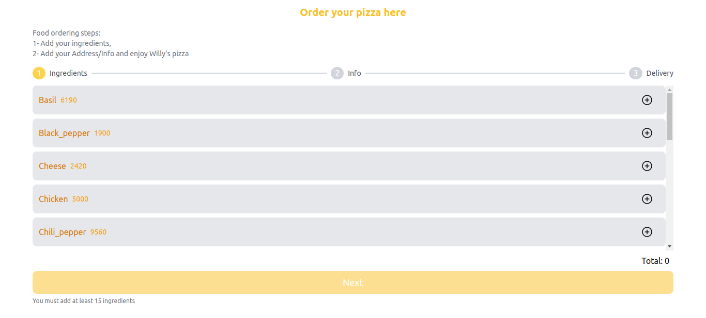
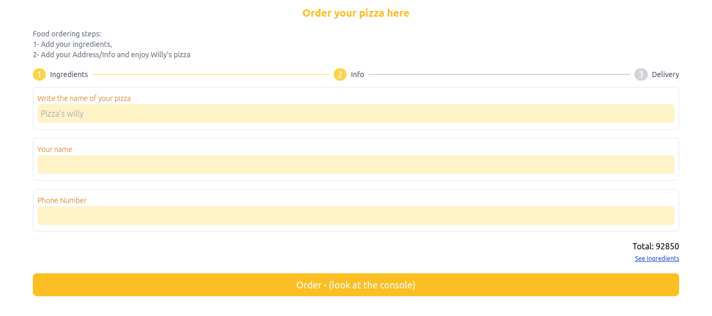
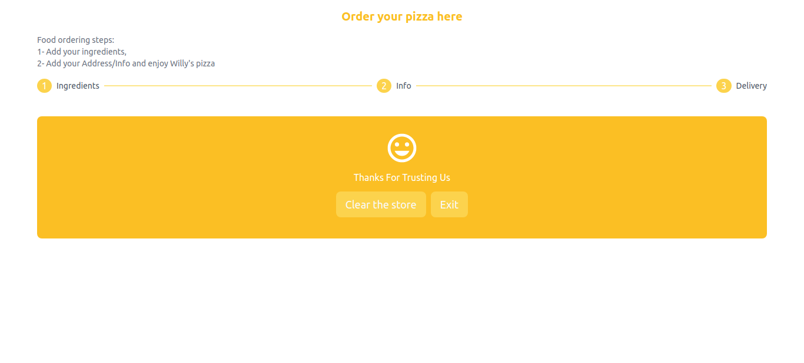
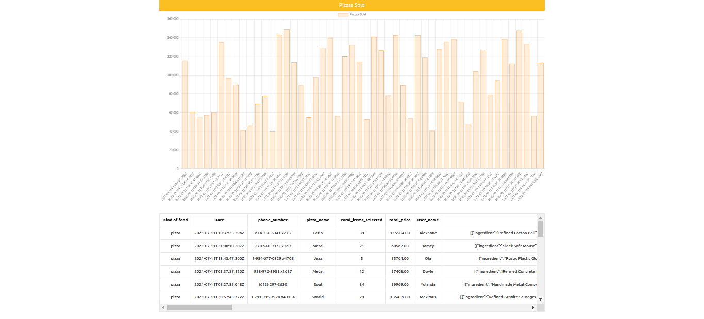

# Willy's Pizza

## Demo
https://willys-pizza.vercel.app/







## Frontend URLs
- https://willys-pizza.vercel.app/ // Home
- https://willys-pizza.vercel.app/order // Para ordenar una pizza como usuario
- https://willys-pizza.vercel.app/dashboard // Gráfico de barra y tabla con historicó de ventas de pizzas 
## Backend Endpoints
- https://willys-pizza.vercel.app/api/dashboard // Retorna los datos de las pizzas vendidas
- https://willys-pizza.vercel.app/api/ingredients/pizza // Retorna los ingredientes para pizza

## 

## Tecnologías
- ReactJS - TypeScript - NextJS
- TailwindCSS - 100% Responsive
- Redux - State global
- ChartJS

## Para correr el proyecto en local

Tener instalado Nodejs y NPM

```bash
$ npm i
$ npm run dev
```

Open [http://localhost:3000](http://localhost:3000)

## Test Unitarios

Solo tienen test los componentes: Counter y Steps

Tener instalado jest de manera global

```bash
$ jest
```
